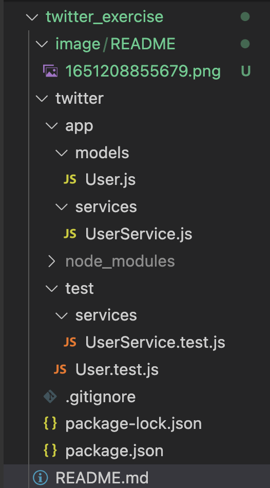

# Práctica: Twitter.

Práctica que contiene los ejercicios :

3. Modelos

5. Servicios
6. Vistas

Backend NodeJS - LaunchX.

### ¿Qué es twitter?

Twitter es una red social y servicio de microblogging para la comunicación en tiempo real. Es gratuita y es utilizada por millones de personas y organizaciones. 

Como dato para mera documentación, en twitter, un usuario almacena distinta información, como, su nombre, nombre de usuario, biografía, fecha de nacimiento, etc.

### Objetivo del proyecto.

La meta de la presente práctica es intentar simular el funcionamiento de Twitter en cuanto a un usuario: su creación, actualización y las obtenciones de algunas listas y respuestas. Modelando las interfaces o clases necesarias y almacenando información para su manipulación.

### Estructura del Proyecto.

En la siguiente imagen, se visualiza la estructura y organización del proyecto, partiendo por una carpeta que se llama twitter y que contiene todo el código funcional del aplicativo.

Dentro de twitter, yacen dos subcarpetas: app y test. 

**La carpeta *app*.**

La carpeta app contiene el código funcional, tanto modelos (User) y servicios a utilizarse en todo el proyecto.

**La carpeta *test*.**

El folder test contiene el listado de las pruebas unitarias desarrolladas para probar el correcto funcionamiento del servicio y la clase de User. 

Adicionalmente encontramos algunos otros archivos como el package json que contiene la configuración del proyecto y el listado de las dependencias instaladas (veáse dos apartados más abajo).

### Documentación.

### Dependencias.

### Notas.
